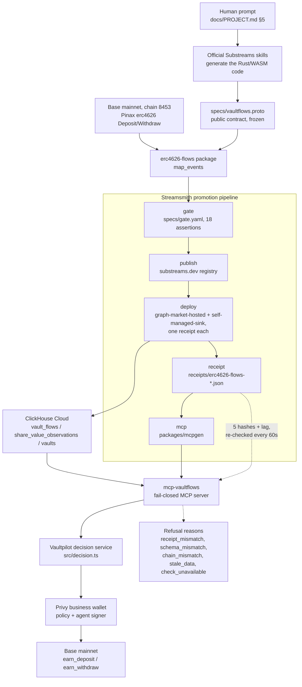

# Streamsmith

Building a blockchain data feed usually means writing indexer code, testing it, operating a database, and then teaching every application how to trust the result. Streamsmith turns one plain-language request into a tested Substreams pipeline, deploys it against live chain data, and creates a receipt connecting the exact code, configuration, database schema and MCP tools; those tools refuse to answer when the data is stale or mismatched. We demonstrate it by tracking tokenized savings vaults and letting a policy-controlled Privy business wallet move real USDC using the resulting live data. One prompt becomes a verifiable data service an agent can safely use.

## What is live right now

The published Substreams package `erc4626-flows` v0.1.0 (output module `map_events`, module hash
`8e4892cfaf2785fe3ff76ba7c7691c8bd8db811a`) is on the substreams.dev registry and runs on Base
mainnet through **two** independent deployments of the same package, each with its own Deployment
Receipt and its own ClickHouse Cloud database:

| | Deployment | Database | Receipt |
|---|---|---|---|
| Live | The Graph Market, `depnywi036749442f3c55e7` | `vaultflows_hosted` | [`…-20260912T103328Z-vipc.json`](receipts/erc4626-flows-v0.1.0-20260912T103328Z-vipc.json) — `deploymentMode: graph-market-hosted` |
| Fallback | self-managed `substreams-sink-sql` | `vaultflows` | [`…-20260910T234439Z-1fr9.json`](receipts/erc4626-flows-v0.1.0-20260910T234439Z-1fr9.json) — `deploymentMode: self-managed-sink` |

The hosted deployment has caught up. On Sept 13 its sink head was block 51,249,575 against a chain
head of 51,249,585 — **10 blocks / ~20 s behind**, well inside the 300-block freshness limit the
generated MCP enforces — so it is the pipeline behind the shipped `mcp-vaultflows` server and the
Vaultpilot dashboard. The self-managed sink into `vaultflows` keeps running as the documented
fallback; neither deployment writes to the other's database. The hosted database's rendered and
dumped sink schemas are byte-identical (sha256
`89f106091e7bdd69b025018f24ecdea75d7f0a8acc9e0087eccd3d1287a20e48`) and both views answer against it
(`runs/20260912T103328Z-vipc/`).

Against that database the generated server's `share_value_growth` tool reported both configured Base
vaults growing in observed-window share value by about **0.064%** over a 135-hour, 94-observation
window (blocks 51,004,800 → 51,247,800), and `vault_flows_24h` answered with a window ending 21 s
behind the wall clock: 3,385 deposits / 1,053 withdrawals on the Gauntlet vault and 890 / 911 on the
Steakhouse vault, with no flow row missing decoded metadata. `pipeline_status` confirmed the receipt
matched the manifest and the live column set matched the receipt's schema hash. The same transcript
records the fail-closed half: a receipt copy with one hash changed refuses with `receipt_mismatch`
while the schema and the lag are still fine, and a zero lag allowance refuses with `stale_data`
while the receipt and the schema are still fine
(`runs/live/cloud/mcp-live-probe-hosted.txt`). The gate behind both receipts passes on this same
live data, including an RPC cross-check against `eth_getTransactionReceipt`/`convertToAssets` at the
cited blocks.

### Recorded one-prompt run

The claim in the first paragraph — one request in, a verified pipeline out — was run once for the
record, in a separate directory with none of this repository's package code in it. The whole of it is
sealed in [`runs/recorded/20260913T114823Z-nyom/`](runs/recorded/20260913T114823Z-nyom/README.md).

The baseline was a commit tagged `clean-start`: 112 files — the frozen contract
`specs/vaultflows.proto`, the gate, the two tools, the workspace — and no `packages/erc4626-flows`.
A human typed one message, the path [`specs/prompt.md`](specs/prompt.md), and nothing after it.

| | |
|---|---|
| Gate | **passed, exit 0** — 18 assertions, 18 passed (16 fail-severity, 2 warn-severity), one `substreams build`, no retries |
| Published | [`substreams.dev/packages/erc4626-flows/v0.1.1`](https://substreams.dev/packages/erc4626-flows/v0.1.1) |
| Module hash | `22c9d75e3161308ee9690d9fa1012eca10ac6ef3` — different code from the reference package's `8e4892cfaf2785fe3ff76ba7c7691c8bd8db811a`, same contract and same gate |
| Deployed | self-managed sink into ClickHouse `vaultflows_rec`; the live databases were untouched |
| Receipt | [`…-v0.1.1-20260913T114823Z-nyom.json`](receipts/erc4626-flows-v0.1.1-20260913T114823Z-nyom.json), with `mcpManifestHash` bound to the MCP server the run generated |
| Time | **4 min 51 s** from the run manifest to the receipt; **9 min 51 s** through applying the package's views |

The folder holds the run records, the generated package source, and the full `git` diff and patch
against `clean-start`, so the boundary between what was given and what was produced is checkable line
by line. No video or terminal capture exists and none is claimed; the evidence is the directory.

## Architecture



Full write-up, one page: [docs/ARCHITECTURE.md](docs/ARCHITECTURE.md). Diagram source, kept
byte-identical to the block above: [docs/diagram.mmd](docs/diagram.mmd).

## Run it

Install once at the repo root: `pnpm install` (pnpm 10.26.1, Node >= 22.18; see
`package.json`/`pnpm-workspace.yaml`).

### `erc4626-flows` — the Substreams package ([README](packages/erc4626-flows/README.md))

```bash
cargo test
substreams build
substreams info erc4626-flows-v0.1.0.spkg
substreams run -e base-mainnet.streamingfast.io:443 erc4626-flows-v0.1.0.spkg map_events \
  --network base -s 51092254 -t +200 -o jsonl --limit-processed-blocks 0
```

### `streamsmith` — the promotion pipeline CLI ([README](packages/streamsmith/README.md))

```bash
pnpm install
pnpm --filter @ethonline26/streamsmith streamsmith --help
pnpm --filter @ethonline26/streamsmith typecheck
pnpm --filter @ethonline26/streamsmith test
pnpm --filter @ethonline26/streamsmith fixtures
```

### `mcpgen` — generates the fail-closed MCP server ([README](packages/mcpgen/README.md))

```bash
pnpm --filter @ethonline26/mcpgen generate
```

### `mcp-vaultflows` — the generated MCP server ([README](packages/mcp-vaultflows/README.md))

```bash
pnpm install
export CLICKHOUSE_URL=http://localhost:8123 CLICKHOUSE_USER=ro CLICKHOUSE_PASSWORD=ropass CLICKHOUSE_DATABASE=vaultflows
export BASE_RPC_URL=https://mainnet.base.org
node bin/server.js
```

### `vaultpilot` — the treasury app ([README](apps/vaultpilot/README.md))

```bash
pnpm typecheck
pnpm test

pnpm agent:once
pnpm agent:once --source fixture --offline
pnpm web:dev
```

## Sponsor evidence

Qualification bullets are quoted from `docs/PRIZES.md`; every row cites the exact file or artifact
that satisfies it. Where a bullet is not yet satisfied, that is stated instead of a claim.

### The Graph

**Composable / Standardized Graph products ($5K)**

| Bullet | Evidence |
|---|---|
| "Must compose 2+ Graph products OR build meaningfully on a standardized schema" | Imports Pinax's `erc4626` Substreams package and layers a documented, versioned ERC-4626 output contract on top of it: [`specs/vaultflows.proto`](specs/vaultflows.proto); module graph in [`packages/erc4626-flows/README.md`](packages/erc4626-flows/README.md#modules) (`erc4626:map_events` → `map_flows`/`map_share_value_observations` → `map_events`). |
| "Live data only (Subgraph Studio / The Graph Market). Mocked/local/static = DQ" | Hosted on The Graph Market and serving the live tools: deployment `depnywi036749442f3c55e7`, [receipt](receipts/erc4626-flows-v0.1.0-20260912T103328Z-vipc.json) with `deploymentMode: graph-market-hosted` and `mcpManifestHash` bound to the shipped MCP, deploy and views evidence in [`runs/20260912T103328Z-vipc/`](runs/20260912T103328Z-vipc/README.md), and a live stdio probe at a 10-block lag with both refusals in [`runs/live/cloud/mcp-live-probe-hosted.txt`](runs/live/cloud/mcp-live-probe-hosted.txt). Fallback self-managed sink on the same Graph endpoint: [receipt](receipts/erc4626-flows-v0.1.0-20260910T234439Z-1fr9.json) (`endpoint: base-mainnet.streamingfast.io:443`, `headBlock 51148236`, `lagBlocks 228`) with a live query result in [`runs/live/cloud/mcp-live-probe.txt`](runs/live/cloud/mcp-live-probe.txt). |
| "Show what became easier because of the shared schema" | [`packages/erc4626-flows/README.md`](packages/erc4626-flows/README.md#compose-it) "Compose it": any package can `import` the module unmodified or `use:` a submodule directly, params overridable with `-p`. |
| "Public repo + 2–4 min video" | Repo is public. **Video not recorded yet — left out; see Limitations.** |

**AI Tooling / AI Use Case, From Scratch ($5K)**

| Bullet | Evidence |
|---|---|
| "Featured challenge: Substreams SKILLs → one prompt → deployed Substreams pipeline" | Done once for the record and sealed in [`runs/recorded/20260913T114823Z-nyom/`](runs/recorded/20260913T114823Z-nyom/README.md): from a 112-file `clean-start` tag with no `packages/erc4626-flows`, one message and nothing else gave gate 18/18 (exit 0), [`erc4626-flows` v0.1.1](https://substreams.dev/packages/erc4626-flows/v0.1.1) on the registry (module hash `22c9d75e…`), a live sink into `vaultflows_rec`, generated MCP tools and a [receipt](receipts/erc4626-flows-v0.1.1-20260913T114823Z-nyom.json) — 4 min 51 s to the receipt. Code generation via the official skills is disclosed in [AI-USAGE.md](AI-USAGE.md); the protocol is `docs/PROJECT.md` §5. Evidence is the run directory and the diff against the tag, not a recording hash. |
| "Graph must be load-bearing; live data via Studio API key or Graph Market" | Same receipt and live probe as above. |
| "Meaningful work with the data: reasoning, decisions, automation, or NL interface" | [`apps/vaultpilot/src/decision.ts`](apps/vaultpilot/src/decision.ts) turns two vaults' observations into a rotate/hold decision with a stated reason; [`packages/mcp-vaultflows/README.md`](packages/mcp-vaultflows/README.md) exposes semantic tools (`vault_flows`, `share_value_growth`, ...), not a raw-SQL passthrough. |
| "Tooling submissions must be reusable infra, not a single end-user app" | [`packages/streamsmith/README.md`](packages/streamsmith/README.md) (promotion pipeline, works on any gated Substreams package) and [`packages/mcpgen/README.md`](packages/mcpgen/README.md) (generates a fail-closed MCP server from any proto contract + receipt, not just this one). |
| "Open source with README/SKILL.md; public repo + video" | Package READMEs linked above; `skills/streamsmith/` referenced in [`packages/streamsmith/README.md`](packages/streamsmith/README.md#layout). Video: see Limitations. |

### Privy

**Best B2B financial product ($2.5K)**

| Bullet | Evidence |
|---|---|
| "Privy core; ≥1 Privy wallet" | Business wallet `0xcdC8B69799bCb135C04A1052b918787125571fDC` in [`docs/build/privy-spike.md`](docs/build/privy-spike.md). |
| "Business use case; ≥1 functional B2B workflow (treasury op)" | The observed-window-growth rotation rule: [`apps/vaultpilot/README.md`](apps/vaultpilot/README.md#the-rule-docsprojectmd-43). |
| "≥1 Privy control (policies, signers, key quorums, or intents)" | Policy builder [`apps/vaultpilot/src/policy.ts`](apps/vaultpilot/src/policy.ts); live policy `gghm9iorl3flfaybrqmlvisf` and agent signer `yfd2jb9phfeufhh2aibpjw3s` attached as `additional_signers[0]` in [`docs/build/privy-spike.md`](docs/build/privy-spike.md). |
| "Working demo + source" | Source under `apps/vaultpilot/src/`. The one beat executed for real (not dry run) so far is the denied, unapproved-vault call: `docs/build/privy-spike.md` — "Denial: unapproved vault \| HTTP 404 `Vault not found`". The allowed/executed beat has not run for real yet — see Limitations. |
| "Explain how Privy enables it" | [`apps/vaultpilot/README.md`](apps/vaultpilot/README.md) in full. |

**Best financial flow ($2.5K)**

| Bullet | Evidence |
|---|---|
| "Privy core; ≥1 wallet" | Same wallet as above. |
| "≥1 functional flow using a generally available feature (self-service Earn vaults)" | Both Earn vaults are configured and reachable with real position reads (`docs/build/privy-spike.md`, "Positions"). **No real Earn deposit/withdraw transaction has executed yet** — left out of a "done" claim; see Limitations. |

## Limitations

- **Two deployments, one of them a fallback.** `depnywi036749442f3c55e7` on The Graph Market is the
  live pipeline: it caught up on Sept 13 and now serves the MCP and the dashboard from
  `vaultflows_hosted`. The self-managed `substreams-sink-sql` process into `vaultflows` is still
  running as the fallback and keeps its own receipt, so a figure quoted from one database is not
  interchangeable with the other — the receipt hash in each response says which one answered. The
  first hosted attempt (`depdehi448c87998ebb763b`) crash-looped on a parameters-format error — root
  cause, why a reconfigure could not repair it, and the fix are in
  [`docs/build/sink-spike.md` §7.2](docs/build/sink-spike.md).
- **10% wrapper fee.** Both Privy Earn vaults are fee wrappers around the underlying Morpho vaults,
  and each wrapper keeps 10% of generated returns. The pipeline observes the underlying vault, so
  every growth figure shown is *before* that fee — disclosed in
  [`apps/vaultpilot/README.md`](apps/vaultpilot/README.md#fee-disclosure) and
  [`docs/build/vaults.md`](docs/build/vaults.md).
- **Observed-window semantics.** All growth numbers are "observed-window share-value growth,
  blocks X–Y", from sampled `convertToAssets` calls only, never interpolated between samples, and
  never a statement about anything beyond the streamed range
  (`packages/erc4626-flows/README.md#caveats-read-before-quoting-numbers`).
- **No rotation executed yet.** Every decision-service run recorded so far is a dry run against a
  hand-built fixture (`docs/TASKS.md` T4.8 is only partially done); the one real Privy call executed
  is the denied-vault demo. No real Base deposit, withdrawal or rotation transaction exists in the
  repo yet.
- **`packageHash` is not reproducible.** An `.spkg` embeds its proto files in a nondeterministic
  order and its wasm is host-dependent, so an identical rebuild produces a different `packageHash`.
  `outputModuleHash` is the reproducible identity the fail-closed check relies on — see
  [`packages/streamsmith/README.md#what-the-receipt-binds`](packages/streamsmith/README.md#what-the-receipt-binds).
- **Demo video** for either sponsor track does not exist in the repo yet, so it is left out of the
  evidence tables above rather than claimed.

## More

- [AI-USAGE.md](AI-USAGE.md) — what was AI-generated and how, including the hand-built reference
  implementation used to design the schema and gate.
- [feedback/](feedback/) — friction logs kept from the first minute on both The Graph and Privy
  integrations.
- [docs/research/codex-discussion.md](docs/research/codex-discussion.md) — the design discussion
  with OpenAI Codex that produced this v2 plan.
