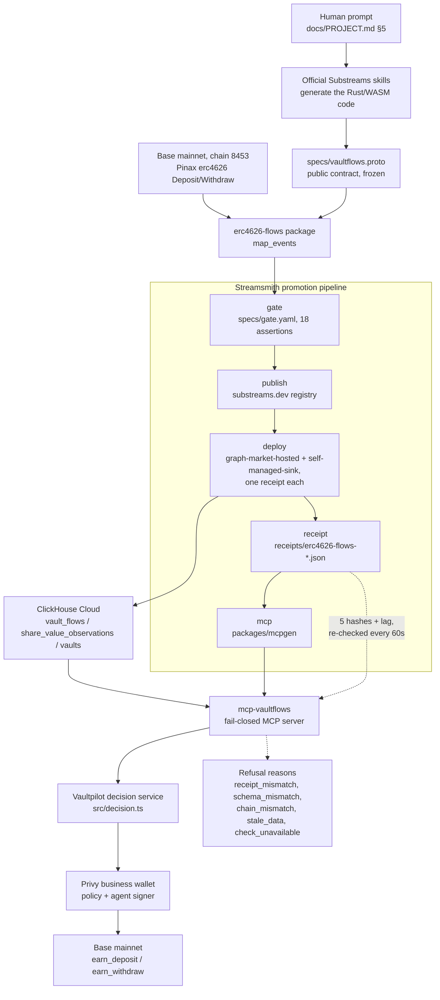

# Architecture

Streamsmith is a promotion and provenance layer for AI-generated Substreams packages. It does not
generate Substreams code itself — the official Substreams skills do that from a plain-language
prompt against the frozen public contract in `specs/vaultflows.proto`. Everything after the code
exists (gate, publish, deploy, receipt, MCP) is Streamsmith's own contribution, proven here on one
package, `erc4626-flows`, and one consuming app, Vaultpilot, moving USDC through a policy-controlled
Privy business wallet on Base.

## Diagram

Source: `docs/diagram.mmd` (kept byte-identical to the block above).

## The promotion pipeline, stage by stage

1. **Prompt.** A human gives one instruction against a frozen contract (`specs/vaultflows.proto`,
   `specs/streamsmith.yaml`, `specs/gate.yaml`) — the verbatim text is in `docs/PROJECT.md` §5.
2. **Skills.** The official StreamingFast Substreams skills write the Rust module code. Streamsmith
   never edits `specs/*`; a changed contract changes `descriptorHash` and the gate fails on purpose
   (`packages/streamsmith/README.md`).
3. **Gate.** `specs/gate.yaml` runs a build, three fixed-range `substreams run`s and 18 assertions
   (row counts, a known vault present, an RPC cross-check against live `eth_call`/`eth_getTransactionReceipt`,
   a deterministic-rerun hash comparison, the descriptor-hash match, banned-word scan). Exit code 0
   only when every `severity: fail` assertion passes. Evidence: the recorded gate result inside
   `receipts/erc4626-flows-v0.1.0-20260910T234439Z-1fr9.json` (`gate.passed: true`, 18/18 assertions).
4. **Publish.** The `.spkg` is packed and pushed to the substreams.dev registry as `erc4626-flows`
   v0.1.0 (`docs/STATUS.md`, Sept 10 22:10 entry).
5. **Deploy.** Either `graph-market-hosted` (The Graph Market Portal API) or `self-managed-sink`
   (`substreams-sink-sql from-proto` against a self-provisioned database). Both are live for this
   package, each writing to its own ClickHouse Cloud database and each carrying its own receipt:
   hosted deployment `depnywi036749442f3c55e7` → `vaultflows_hosted`
   (`receipts/erc4626-flows-v0.1.0-20260912T103328Z-vipc.json`), self-managed sink → `vaultflows`
   (`receipts/erc4626-flows-v0.1.0-20260910T234439Z-1fr9.json`). A deployment that is already running
   is recorded with `streamsmith deploy hosted --attach`, which uses read-only Portal calls only —
   `Deploy`, `UpdateDeploymentConfig` and `CreateDeployment` all restart or duplicate a running pod,
   so none of them may be used to produce evidence about one. See Limitations in the root README for
   the hosted deployment's backfill status and `docs/build/sink-spike.md` §7.2 for the start-command
   failure that made a fresh deployment necessary.
6. **Receipt.** The central artifact, validated against `specs/receipt.schema.json` before it is
   written. See "What each hash binds" below.
7. **MCP.** `packages/mcpgen` reads the proto contract, the receipt and the applied views
   (`packages/erc4626-flows/sql/views.sql`) and emits `packages/mcp-vaultflows`, a typed, read-only
   MCP server whose tools refuse to answer when the live deployment no longer matches the receipt.
8. **Vaultpilot.** Reads the same data (via the MCP's fail-closed logic, ported as a pure function)
   and turns two vaults' observed-window share-value growth into a rotate/hold decision
   (`apps/vaultpilot/src/decision.ts`).
9. **Privy.** Vaultpilot's agent signer is attached to a Privy business wallet under one policy that
   allows only `earn_deposit`/`earn_withdraw` on two pinned vault ids, under a per-action cap; every
   other method is denied by default (`apps/vaultpilot/src/policy.ts`, `docs/build/privy-spike.md`).
10. **Base.** Approved actions execute against the two Morpho vaults' Privy fee wrappers on Base
    mainnet (chain id 8453).

## What each hash in the receipt binds

| Field | What it identifies | Reproducible? |
|---|---|---|
| `outputModuleHash` | The Substreams module hash of `map_events`, from `substreams info <spkg> --json`. | Yes — same source + same toolchain reproduces it. This is the identity the fail-closed MCP check leans on. |
| `packageHash` | sha256 of the exact `.spkg` bytes. | No — an `.spkg` embeds its proto files in a nondeterministic order and the wasm is host-dependent, so an identical rebuild produces a different `packageHash`. Artifact identity only, not source identity. |
| `protoDescriptorHash` | sha256 of the normalized `FileDescriptorSet` of `specs/vaultflows.proto`. | Yes, by construction of the normalization algorithm in `specs/gate.yaml`. |
| `parametersHash` / `parameters` | Canonical JSON of the pinned vault list, sampling interval and chain id. | Yes. |
| `sinkSchemaHash` | sha256 of the normalized DDL actually applied to the sink. | Yes, per applied schema. |
| `mcpManifestHash` | sha256 of the `manifest.json` the generated MCP server ships with. | Yes, generation is deterministic (no timestamps, no absolute paths). |
| `deploymentMode`, `deploymentId`, `endpoint`, `startBlock`, `headBlock`, `lagBlocks`, `lagSeconds` | Which sink is live, where, and how far behind chain head it is. | N/A — live state, re-read on every check. |

(`packages/streamsmith/README.md` "What the receipt binds" is the source of record for this table.)

## The fail-closed contract

`checkReceiptAgainstLive` (exported from `@ethonline26/streamsmith/receipt`, run by every generated
MCP server on startup and every 60 seconds) refuses to answer rather than serve unverified data. The
exact refusal reasons, verbatim from `packages/mcp-vaultflows/README.md`:

| `reason` | Trigger |
|---|---|
| `receipt_mismatch` | The on-disk receipt's `packageHash`, `outputModuleHash`, `parametersHash`, `protoDescriptorHash` or `sinkSchemaHash` no longer equals the one this server was generated for. |
| `schema_mismatch` | The live `system.columns` of the four expected tables (`vault_flows`, `share_value_observations`, `vaults`, `share_transfers`), normalized and hashed, no longer equals `manifest.json`'s `columnSetHash`. Reported with `expected`/`actual` column sets and a diff. |
| `chain_mismatch` | `BASE_RPC_URL`'s `eth_chainId` does not equal the receipt's chain. |
| `stale_data` | `chainHead - headBlock > MAX_LAG_BLOCKS` (default 300 blocks, about 10 minutes on Base). |
| `check_unavailable` | Any of the above could not be evaluated at all (ClickHouse or RPC unreachable, receipt unreadable) or the last successful check is older than 3 check intervals. |

Every data tool returns `{ "refused": true, "reason": "<reason>", "detail": ..., "expected": ...,
"actual": ..., "checkedAt": ..., "provenance": {...} }` with `isError: true` instead of falling back
to unverified data. `pipeline_status` never refuses — it always reports the verdict, so it is the
tool to call first. Vaultpilot's decision service applies the same fail-closed rule (stale sink data,
an unreadable receipt, or a schema mismatch all resolve to `hold`, never a guess).
