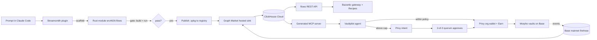

# Project Draft: Substreams from a Sentence

*ETHOnline 2026 · draft v1 · Sept 9, 2026 · for review before build*

Working names (all placeholders, veto freely): **Streamsmith** (the Claude Code plugin), **erc4626-flows** (the published Substreams module), **Vaultpilot** (the savings app that consumes it).

---

## 1. One paragraph

You describe a blockchain data feed in one paragraph. Claude Code, using The Graph's Substreams skills plus our plugin, writes the Rust indexer, runs the mandatory local quality gate, publishes the package, deploys it to The Graph's hosted infrastructure against our ClickHouse, and generates an MCP server so any AI agent can query the live tables. We use that machine to ship the first useful data layer for ERC-4626 yield vaults (net flows, share price, TVL deltas, depositor moves, anomalies) on Base, and a small treasury app on Privy that moves real USDC between Morpho vaults when our own feed says one is bleeding. From a sentence, to a deployed pipeline, to money moving. Three artifacts, one story.

## 2. Why this, in three lines

- **It is the only concept on our list with zero prior entrants.** We checked 873 showcase projects. The Graph's featured "one prompt to deployed Substreams pipeline" challenge is new; the ERC-4626 flows module is literally the example in their prize text and Pinax's README says the flows and share-price layer is "a downstream derivation" nobody has published.
- **It is our lane.** The whole build is driving Claude Code well, plus TypeScript, plus a bounded amount of Rust.
- **Every sponsor is load-bearing.** Remove The Graph and there is no data. Remove Privy and no money moves. Remove Bazantic and agents can't discover or pay for the feed.

## 3. What exists today, and the gap

| Layer | Exists | Missing |
|---|---|---|
| Raw ERC-4626 events | Pinax `erc4626` v0.1.0: `map_events` matches `Deposit`/`Withdraw` by signature on every vault, chain-agnostic, Base default | Anything derived: flows, share price, TVL, depositor counts, anomalies. Decimal normalization. Vault disambiguation (non-4626 contracts can emit same-signature events). |
| Deploy path | Substreams skills (9), Graph Market hosted sink (Portal API `HostedService`, bring your own Postgres/ClickHouse), device-code auth | A closed loop from prompt to deployed sink to agent-queryable tool. The skills stop at deploy. |
| Agent access | Subgraph MCP for subgraphs | No MCP over Substreams sink tables. No provenance (which package hash, which deployment, how fresh). |
| Money | Privy self-serve Earn: Morpho **Gauntlet USDC Prime** and **Steakhouse Prime** on **Base mainnet**; policies with an `earn` method; key quorums; intents; webhooks | Anyone using Earn as the product, driven by live data, bounded by policy and quorum. Showcase Privy winners were "wallet plus a transfer". |

## 4. What we build

### 4.1 Streamsmith: the plugin (reusable artifact, Graph AI track)

A Claude Code plugin that composes the official Substreams skills into one loop and adds the two pieces they lack.

1. **Scaffold** from the prompt: manifest, protos, Rust module skeleton, imports of the packages to compose on.
2. **Gate**: `substreams build`, then `substreams run` over a fixed block range with assertions (rows produced, no decode errors, expected vault appears). This is the quality gate the skills mandate; we make it a script with a pass/fail exit so it is visible on camera.
3. **Publish**: pack and publish the `.spkg` to the registry so it is a public, importable package.
4. **Deploy**: hosted sink on The Graph Market via the Portal API, attaching our ClickHouse, then poll `GetDeploymentState` until head block and lag are healthy.
5. **Expose**: introspect the ClickHouse schema and generate a TypeScript MCP server with typed tools, SQL templates, and a `pipeline_status` tool that returns provenance (package hash, deployment id, head block, lag). This is the piece that turns any pipeline into something an agent can use.
6. **Record**: write the case study (prompt, transcript pointers, timings) into the repo, matching the format of the 16 case studies in the skills repo.

Ships as a plugin repo with `SKILL.md`, scripts (Bun/TypeScript), and a README that a judge can run.

### 4.2 erc4626-flows: the module (the contribution, Graph Composable track)

Composes Pinax `erc4626` (events) and Pinax `erc20` (share transfers) into a standardized vault-flows package.

Module graph:

- `map_events` (imported from Pinax) → raw Deposit/Withdraw.
- `store_vault_meta`: on first sight of a vault address, `eth_call` `asset()`, `decimals()`, and the asset's `decimals()`. If `asset()` reverts, it is not a 4626 vault and is dropped (this is the disambiguation Pinax's README asks the serving layer to do). Cached in a store so it is one call per vault, ever.
- `map_flows`: per event, normalized `assets` and `shares`, implied share price, direction, vault, depositor, tx, block, timestamp. Fee-spread caveat handled by keeping deposit-implied and withdraw-implied prices as separate columns.
- `store_vault_totals`: running net flow and share supply per vault.
- `map_vault_snapshots`: per block per touched vault: net flow, TVL delta, share price, unique depositors so far.

ClickHouse (from-proto, insert-only) tables: `vaults`, `vault_flows`, `vault_snapshots`. Materialized views: `vault_flows_1h`, `vault_flows_24h`, `vault_anomalies` (24h outflow over 20 percent of TVL, or share-price drop). Parameterized by chain; Base first, Ethereum second if time allows. Published as a versioned package so anyone can `use` it.

### 4.3 Vaultpilot: the app (the proof, Privy both tracks)

A small-business idle-cash autopilot, deliberately framed B2B to hit both Privy tracks.

- **Organization wallet** owned by a 2-of-3 key quorum (founders). The agent is an **additional signer** under a policy: `earn` method allowed only for the two Morpho vaults, per-transaction cap, rolling daily cap via an aggregation.
- **Earn**: deposit USDC into Gauntlet USDC Prime via Privy Earn. Gas sponsorship on.
- **Agent loop** (server): every few minutes, query the flows MCP. If the current vault is flagged (24h net outflow above threshold, or share-price drop, or whale exit), propose a rotation to the healthier vault.
- **Within policy**: execute withdraw and deposit automatically. **Above cap**: create a Privy **intent**; approvers get a notification via the `intent.created` webhook and approve in our UI or the Privy dashboard; `intent.executed` closes the loop.
- UI: one screen. Balance, current vault, the live feed signal that triggered the proposal, the policy that applied, the approval state, transaction links.

Real money: fund with about 50 USDC on Base. Rotations are small.

### 4.4 Bazantic wrapper (third pick)

A thin HTTP API over the same ClickHouse tables (the MCP's SQL templates exposed as REST), described by an OpenAPI spec, registered on Bazantic as an x402 gateway plus MCP server. Two Recipes: "rank Base vaults by 24h net flow" (single service) and "rank vaults, then fetch vault metadata via The Graph's x402 subgraph endpoint" (two services, qualifies for Best Recipe). Since our API did not exist before, it also qualifies for "Agentify a new API".

## 5. Architecture



Chains: Base mainnet for everything (Morpho vaults, Privy Earn, Substreams). The Graph Market free tier is 7M blocks and 5 GiB egress; Base produces a block every 2 seconds, so we start indexing from a recent block (about six weeks back) rather than genesis.

## 6. How each sponsor is satisfied

| Sponsor and track | Their requirement | Our evidence |
|---|---|---|
| **The Graph: Composable / Standardized** ($5K, 3 places) | Compose 2+ Graph products or build on a standardized schema; contribute a composable Substreams module for an emerging standard such as ERC-4626; live data from a Graph provider; show what the standard made easier | `erc4626-flows` imports two Pinax packages and is published as a reusable package; runs live on Graph Market; composed with the MCP layer; one pipeline, every vault on the chain, no address list, reusable across chains |
| **The Graph: AI Tooling, From Scratch** ($5K, 3 places) | Tooling that makes The Graph easier to use from Claude/Cursor: MCP servers, SKILLs, plugins; featured challenge: deploy a working Substreams pipeline from a single prompt using the Substreams SKILLs; open source with SKILL.md; reusable infra, not a single app | Streamsmith plugin plus generated MCP; the recorded one-prompt session with the quality gate visible; case study committed |
| **Privy: Best B2B financial product** ($2.5K) | Privy core; ≥1 wallet; business use case; ≥1 B2B workflow; ≥1 control (policies, signers, key quorums, intents) | Org wallet, key quorum, agent as additional signer under policy, intent approval flow |
| **Privy: Best financial flow** ($2.5K) | ≥1 functional flow using a GA feature; self-service Earn vaults are listed as eligible | Earn deposit, withdraw, rotation between the two self-serve Morpho vaults |
| **Bazantic: Best Recipe with sponsor APIs** ($1K) | Gateway for our project; recipe using our service plus another sponsor's service in one flow; screen recording; username in submission | Flows API gateway; recipe chaining our ranking with The Graph x402 subgraph metadata |
| **Bazantic: Agentify a new API** ($1K) | Add a service not previously on Bazantic and not a sponsor API; working gateway; recipe within our project | Our flows API is new by construction |

Ceiling about $11K. Realistic expectation is one to two placements. Finalist judging is separate and the live money-moving demo competes there on its own.

## 7. The demo video (target 3:30, hard limits 2:00 to 4:00)

1. **0:00 to 0:20.** The problem in one sentence: chain data is useless until indexed, indexing takes a week, and agents can't use it anyway.
2. **0:20 to 1:30.** The one-prompt session, unedited except for cutting compile waits (cuts are allowed, speed-ups are not). Quality gate visibly passing. Publish. Deploy. `GetDeploymentState` showing head block advancing.
3. **1:30 to 2:15.** Rows landing in ClickHouse. In Claude, via the generated MCP: "Which Base vaults lost more than 20 percent of assets in the last 24 hours, and who withdrew?" Real answer with provenance.
4. **2:15 to 3:10.** Vaultpilot. The feed flags a vault. The agent proposes a rotation. It is above the cap, so an intent appears. A founder approves on their phone. USDC moves out of one Morpho vault into the other. Explorer links.
5. **3:10 to 3:30.** Architecture slide. What is reusable: the plugin, the published module, the MCP generator.

Human voice, 1080p, no phone recording, no music-only segments, no TTS.

## 8. Risks and what we do about them

| Risk | Likelihood | Mitigation |
|---|---|---|
| Rust toolchain and WASM builds slow on a laptop | High | Install and build the Pinax package tonight; cache the target dir; keep the module small |
| Hosted sink is a beta; deploy or attach fails | Medium | Day-1 spike deploys Pinax's own package first, before our module exists. Fallback: self-managed `substreams-sink-sql` to the same ClickHouse, deploy path still live via Graph Market streaming |
| `eth_call` for vault metadata slows the stream | Medium | One call per new vault, cached in a store; batch with `RpcBatch`; cap concurrency |
| Key quorums or organizations are plan-gated on a free Privy app | Medium | Day-1 spike creates org, quorum, intent. Fallback: single owner plus additional signer plus policies plus intents still satisfies "≥1 control" |
| Privy Earn needs gas sponsorship and real USDC | Low | Enable sponsorship in dashboard; fund 50 USDC on Base |
| The one-prompt recording is not genuinely one prompt | Medium | Rehearse twice, then record once. If the agent needs a nudge, show it. Judges reward honesty; the skills repo has two cautionary case studies for this reason |
| Graph Market free tier limits | Low | Start block six weeks back; monitor egress |
| Time. Four days, one of them mostly gone | High | MoSCoW below. Stretch items are the first cut |

## 9. Decisions needed from you

1. **Names.** Streamsmith, erc4626-flows, Vaultpilot: keep, change, or leave placeholders until Friday.
2. **App framing.** B2B org wallet with quorum (hits both Privy tracks, more setup) versus consumer savings (one track, simpler). Draft assumes B2B.
3. **Third sponsor.** Bazantic (half a day) versus Chainlink Confidential (a day, policy in an enclave). Draft assumes Bazantic; Chainlink is a stretch item.
4. **ERC-8004 as second worked example.** Only if the vault module is deployed by end of Sept 10. Yes or no in advance so I don't drift.
5. **Who records the video and on what setup.** Needs a real microphone and screen capture at 1080p.

## 10. What I need from you

- Graph Market account: run the device-code login when I ask (`substreams auth` for streaming, Portal login for hosted sink).
- ClickHouse Cloud trial: create the service, give me the HTTPS endpoint, database, user, password.
- Privy dashboard: create the app, enable gas sponsorship, generate an API key and an authorization key. Try creating an organization and a key quorum; tell me if it's gated.
- Bazantic account: sign up, tell me the username.
- A Base wallet with about 50 USDC and a little ETH for the first deposit.
- Git remote: a public GitHub repo (or org) to push to. Commit history matters for eligibility.

## 11. Timeline

| Day | Focus | Must ship by end of day |
|---|---|---|
| **Sept 9 (tonight)** | Access, toolchain, spikes | Rust plus `substreams` CLI installed; Pinax `erc4626` builds and streams locally; ClickHouse reachable; Graph Market login; hosted sink deploy attempted with Pinax's package; Privy app plus org/quorum spike result |
| **Sept 10** | Module and sink | `erc4626-flows` streaming from Base; published to registry; deployed to hosted sink; rows in ClickHouse; MVs for 24h flows and anomalies |
| **Sept 11** | Plugin, MCP, app | Streamsmith scripts end to end on a fresh prompt; generated MCP answering the vault question in Claude; Vaultpilot doing Earn deposit and a policy-bounded rotation; intent flow working. **Feature freeze at midnight.** |
| **Sept 12** | Bazantic, docs, video | Gateway and two recipes; README, SKILL.md, AI-USAGE.md, feedback docs, architecture diagram; rehearse twice, record once; test-upload |
| **Sept 13 (morning IST)** | Buffer | Fix whatever broke; submit before 12:00 EDT (21:30 IST) |

MoSCoW: **Must** = module, hosted deploy, MCP, one-prompt recording, Earn deposit plus one rotation, README. **Should** = intent/quorum flow, Bazantic, anomaly MVs, case study. **Could** = Ethereum as second chain, ERC-8004 second module, Chainlink enclave policy. **Won't** = anything on Arc or Hedera, a consumer landing page, a token.

## 12. Repository layout

```
ethonline26/
  packages/erc4626-flows/      Rust Substreams package (manifest, protos, src, schema.sql)
  packages/streamsmith/        Claude Code plugin: SKILL.md, scripts/ (scaffold, gate, publish, deploy, mcpgen, casestudy)
  packages/mcp-vaultflows/     Generated MCP server (TypeScript) + provenance tool
  apps/vaultpilot/             Next.js app: Privy embedded/org wallet, Earn, agent loop, approvals UI
  apps/flows-api/              Hono REST over ClickHouse for Bazantic, OpenAPI spec
  docs/                        This draft, prizes, research, architecture diagram
  feedback/                    graph.md, privy.md, bazantic.md (friction log, judges read these)
  specs/                       Prompts and planning artifacts (required when using AI tools)
  AI-USAGE.md                  Attribution of AI-assisted work (required)
```

---

## 13. Exhaustive task list

Legend: **[M]** must, **[S]** should, **[C]** could. Estimates are focused hours. "Dep" lists task IDs that must finish first. Acceptance is what "done" means.

### 0. Access and accounts (Sept 9, needs you)

- **0.1 [M]** Create public GitHub repo, push `docs/`, `git init` history starts today. 0.25h. Acceptance: first commit visible on GitHub.
- **0.2 [M]** Graph Market: create account, run `substreams auth` device flow, capture streaming API key into `.env`. 0.25h. Acceptance: `substreams run` against a Pinax package returns blocks.
- **0.3 [M]** Graph Market: Portal device-code login for hosted sink (via `thegraph-market-api` skill). 0.25h. Acceptance: token stored, `ListDeployments` returns.
- **0.4 [M]** ClickHouse Cloud trial: create service, database `vaultflows`, user with DDL rights, note HTTPS and native endpoints. 0.5h. Acceptance: `clickhouse-client` or HTTPS query returns `SELECT 1`.
- **0.5 [M]** Privy: create app, enable gas sponsorship, create API key and authorization key. 0.5h. Acceptance: server wallet created via API.
- **0.6 [S]** Privy: attempt to create an Organization and a 2-of-3 key quorum; record whether it is gated. 0.5h. Dep 0.5. Acceptance: quorum exists or gating confirmed and fallback chosen.
- **0.7 [S]** Bazantic: sign up, note username, skim gateway creation. 0.25h.
- **0.8 [M]** Fund a Base wallet with about 50 USDC plus gas; note address. 0.25h.
- **0.9 [M]** Start `feedback/graph.md`, `feedback/privy.md`, `feedback/bazantic.md`, `AI-USAGE.md`, `specs/README.md`; log friction from the first minute. 0.25h.

### 1. Toolchain and kill-risk spikes (Sept 9)

- **1.1 [M]** Install Rust stable, `wasm32-unknown-unknown` target, `substreams` CLI, `buf`; verify versions. 0.5h. Acceptance: `substreams --version` and `cargo build --target wasm32-unknown-unknown` on a hello project.
- **1.2 [M]** Install Substreams skills plugin into Claude Code (`claude plugin marketplace add streamingfast/substreams-skills`, install all nine). 0.25h. Acceptance: skills listed.
- **1.3 [M]** Clone `pinax-network/substreams-evm`, build `erc4626`, `substreams run` on Base for 200 blocks. 1h. Dep 1.1, 0.2. Acceptance: Deposit/Withdraw events printed for real Morpho vaults.
- **1.4 [M]** Spike hosted sink with Pinax's published `erc4626` package: deploy to our ClickHouse, confirm rows. 1.5h. Dep 0.3, 0.4, 1.3. Acceptance: `SELECT count() FROM erc4626_events` grows. Record exact API calls for the plugin's deploy script.
- **1.5 [M]** Spike ClickHouse from-proto sink locally with `substreams-sink-sql` as fallback path. 1h. Dep 1.3, 0.4. Acceptance: same rows via self-managed sink.
- **1.6 [M]** Spike Privy: server wallet on Base, `earn` policy rule, Earn `position` read for Gauntlet USDC Prime. 1h. Dep 0.5. Acceptance: API returns position; policy rejects a disallowed vault id.
- **1.7 [S]** Spike `eth_call` from a Substreams module (`asset()`, `decimals()`) with `RpcBatch`; measure block throughput impact. 1h. Dep 1.3. Acceptance: metadata store fills; throughput noted.
- **1.8 [M]** Decide fallback matrix from spikes (hosted vs self-managed sink; quorum vs single owner). 0.25h. Dep 1.4, 1.5, 0.6.

### 2. erc4626-flows module (Sept 10)

- **2.1 [M]** Scaffold `packages/erc4626-flows` with manifest importing Pinax `erc4626` and `erc20` packages; protos for `VaultMeta`, `Flow`, `VaultSnapshot`. 1h. Dep 1.3.
- **2.2 [M]** `store_vault_meta`: first-sight `asset()`/`decimals()` probe, drop non-vaults, cache. 2h. Dep 2.1, 1.7. Acceptance: known non-4626 same-signature contract dropped in tests.
- **2.3 [M]** `map_flows`: normalized amounts, deposit-implied and withdraw-implied share price, direction, depositor. 2h. Dep 2.2. Acceptance: for a known Morpho vault, share price within 1 percent of on-chain `convertToAssets`.
- **2.4 [M]** `store_vault_totals` and `map_vault_snapshots`: net flow, TVL delta, share supply, unique depositors. 2h. Dep 2.3.
- **2.5 [M]** ClickHouse `schema.sql` from proto annotations; tables `vaults`, `vault_flows`, `vault_snapshots`; ORDER BY and PK per SQL skill rules. 1h. Dep 2.4.
- **2.6 [M]** Materialized views: `vault_flows_1h`, `vault_flows_24h`, `vault_anomalies` (24h outflow over 20 percent of TVL, or share-price drop over 0.5 percent). 1h. Dep 2.5.
- **2.7 [M]** Gate script: `substreams build`, `substreams run` over a fixed Base range, assert row counts and a known vault present. 1h. Dep 2.4. Acceptance: exit 0 on good build, non-zero on a deliberately broken decode.
- **2.8 [M]** Publish `erc4626-flows` v0.1.0 to the registry; confirm importable by `use`. 0.5h. Dep 2.7.
- **2.9 [M]** Deploy to hosted sink against ClickHouse; start block six weeks back; monitor lag to head. 1h. Dep 2.8, 1.4. Acceptance: `vault_snapshots` at head, lag under one minute.
- **2.10 [S]** Unit tests with the substreams-testing skill for `map_flows` math (fee spread, virtual offset). 1h. Dep 2.3.
- **2.11 [C]** Parameterize chain; second deployment for Ethereum mainnet. 1.5h. Dep 2.9.
- **2.12 [S]** Package README: what it emits, how to compose on it, caveats (fee spread, offset, disambiguation). 0.5h. Dep 2.8.

### 3. Streamsmith plugin (Sept 11)

- **3.1 [M]** Plugin skeleton: `SKILL.md` orchestrator that routes to the official skills and our scripts; `plugin.json`; install instructions. 1h.
- **3.2 [M]** `scaffold` script: from a prompt-derived spec (chain, packages to compose, protos, module names) generate manifest, protos, Rust skeleton. 2h. Dep 2.1 as the reference output.
- **3.3 [M]** `gate` script: generalize 2.7 (range, assertions from spec). 1h. Dep 2.7.
- **3.4 [M]** `publish` script: pack, publish, capture package URL and hash. 0.5h. Dep 2.8.
- **3.5 [M]** `deploy` script: Portal API flow captured in 1.4; attach ClickHouse; poll `GetDeploymentState`; print head and lag. 2h. Dep 1.4.
- **3.6 [M]** `mcpgen` script: introspect ClickHouse schema and MVs; emit a TypeScript MCP server with one tool per table/view plus parameterized SQL templates, plus `pipeline_status` returning package hash, deployment id, head block, lag. 3h. Dep 2.6, 3.5.
- **3.7 [S]** `casestudy` script: writes `case-studies/<name>.md` with prompt, steps, timings, gate output, deployment id. 0.5h. Dep 3.5.
- **3.8 [M]** End-to-end dry run on a fresh prompt (e.g. "index Aerodrome pool swaps on Base into ClickHouse"): scaffold, gate, publish, deploy, mcpgen. 2h. Dep 3.2 to 3.6. Acceptance: agent answers a question over the new tables. This proves the plugin is not hard-wired to vaults.
- **3.9 [M]** Rehearse the ERC-4626 one-prompt session twice; fix rough edges the skills hit; log to `feedback/graph.md`. 1.5h. Dep 3.8.

### 4. MCP server for vault flows (Sept 11)

- **4.1 [M]** Generate `packages/mcp-vaultflows` with 3.6; tools: `list_vaults`, `vault_flows`, `vault_share_price`, `top_outflows`, `depositor_moves`, `vault_anomalies`, `pipeline_status`. 1h. Dep 3.6.
- **4.2 [M]** Hand-tune tool descriptions and SQL for the demo question; add limits and windows. 1h. Dep 4.1.
- **4.3 [M]** Register in Claude Code and Claude Desktop config; verify the demo question end to end. 0.5h. Dep 4.2.
- **4.4 [S]** Provenance in every response: package hash, head block, lag, "unavailable" if lag over threshold (Graph judges reward this). 0.5h. Dep 4.1.

### 5. Vaultpilot app (Sept 11)

- **5.1 [M]** Next.js app scaffold with Privy React SDK; email login; server routes with Privy Node SDK. 1h. Dep 0.5.
- **5.2 [M]** Org wallet (or single owner fallback) plus agent authorization key as additional signer; policy: `earn` allowed for the two vault ids only, per-tx cap, daily aggregation cap. 2h. Dep 1.6, 1.8.
- **5.3 [M]** Earn deposit into Gauntlet USDC Prime; position read; withdraw. 1.5h. Dep 5.2, 0.8. Acceptance: real tx hashes on Base.
- **5.4 [M]** Agent loop: poll MCP `vault_anomalies` and `vault_flows_24h`; decision rule; propose rotation; execute if within policy. 2h. Dep 4.3, 5.3.
- **5.5 [S]** Intent flow: above-cap proposal creates a Privy intent; webhook `intent.created` to our server; approval UI; `intent.executed` closes. 2h. Dep 5.4, 0.6.
- **5.6 [M]** One-screen UI: balance, vault, triggering signal with provenance, policy applied, approval state, tx links. 2h. Dep 5.4.
- **5.7 [S]** Demo trigger: a "simulate anomaly" switch that lowers the threshold so the rotation fires on camera without waiting for a real 20 percent outflow; label it honestly. 0.5h. Dep 5.4.
- **5.8 [S]** `feedback/privy.md`: what was confusing in policies, quorum, intents. Ongoing.

### 6. Bazantic (Sept 12)

- **6.1 [S]** `apps/flows-api`: Hono REST over the same SQL templates; OpenAPI spec. 1.5h. Dep 4.2.
- **6.2 [S]** Deploy flows-api (Vercel or Fly), public URL. 0.5h. Dep 6.1.
- **6.3 [S]** Bazantic: create x402/MPP gateway and MCP server from the spec. 0.5h. Dep 6.2, 0.7.
- **6.4 [S]** Recipe 1: rank Base vaults by 24h net flow. Recipe 2: rank, then fetch vault metadata via The Graph x402 subgraph endpoint. 1h. Dep 6.3.
- **6.5 [S]** Screen recording of both recipes; username noted for submission. 0.5h. Dep 6.4.

### 7. Stretch (only if 2.9 lands on Sept 10)

- **7.1 [C]** ERC-8004 module from a second prompt: identity, feedback, validations; `verified_feedback` join with erc20 transfers. 4h. Dep 3.8.
- **7.2 [C]** Chainlink CRE confidential workflow holding rotation thresholds; signed decision consumed by the agent loop. 6h. Dep 5.4.
- **7.3 [C]** Ethereum mainnet second deployment (2.11) surfaced in MCP as `chain` parameter. 1h.

### 8. Documentation and submission (Sept 12 to 13)

- **8.1 [M]** Root README: thesis, architecture diagram (Mermaid plus PNG), how to run each package, per-sponsor section pointing to exact files and lines. 2h.
- **8.2 [M]** `SKILL.md` for Streamsmith polished; `packages/erc4626-flows/README.md`; `packages/mcp-vaultflows/README.md`. 1h.
- **8.3 [M]** `AI-USAGE.md` complete; `specs/` contains the prompts used, including the one-prompt session prompt verbatim. 0.5h.
- **8.4 [M]** Feedback docs finalized (Graph, Privy, Bazantic). 0.5h.
- **8.5 [M]** Case study committed to the plugin repo in the skills-repo format. 0.5h. Dep 3.9.
- **8.6 [M]** Architecture PNG exported. 0.25h.
- **8.7 [M]** Submission form: exactly three partners (The Graph, Privy, Bazantic), tick both Graph tracks and both Privy tracks and both eligible Bazantic tracks, Start Fresh pool, Bazantic username, repo link, video link. 0.5h.
- **8.8 [M]** Final commit before deadline; no force pushes after. Submit by 12:00 EDT Sept 13.

### 9. Video (Sept 12)

- **9.1 [M]** Script with timestamps per section 7; rehearse twice against live systems. 1.5h. Dep 3.9, 4.3, 5.6.
- **9.2 [M]** Record the one-prompt session in one take (cuts for compile waits allowed). 1h.
- **9.3 [M]** Record MCP question and Vaultpilot rotation live. 1h.
- **9.4 [M]** Edit to 3:30, 1080p, human voice-over, export, test-upload to the dashboard early to catch rejections. 1.5h.

### 10. Ongoing hygiene

- **10.1 [M]** Commit every logical unit; meaningful messages; never a single-day dump.
- **10.2 [M]** `.env.example` everywhere; no secrets committed; `.firecrawl/` and `target/` ignored.
- **10.3 [S]** Daily 10-line status in `docs/STATUS.md`: done, next, blocked.

Rough total of Must items: about 45 focused hours. Should items add about 15. That is tight for four days with one person and comfortable for two. The freeze on Sept 11 midnight is the real deadline; Sept 12 is entirely documentation and video.
